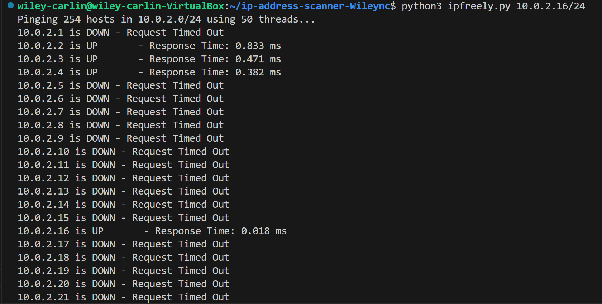

# Ip Address Scanner

This is a script that will take in a ip address with CIDR notation input (e.g., 192.168.1.0/24) and pings all availible ip hosts and returns their status.
 ## Why?
 We made this code so that we can run an ip address in CIDR notation to get all availible hosts in the given ip address list.  Once we have those ip addresses, we ping each host.  Then were given information about the ip address such as its UP or DOWN.
 ## How to run?
 To run this code, one would type python3 ipfreely.py (ip address in CIDR notation).  
 example:
 ```
 python3 ipfreely.py 10.0.2.16/24
 ```
 ## Excepted Responses?
 When run, we can expect two outputs... 
 ### UP 
 We can get the response UP followed by the response time it took to get a response from the ip address.  Example:
 ```
 10.0.2.2 is UP     - Response Time: 0.833 ms
 ```
 We get this response when the pinged ip address is active and being used.
 ### DOWN
 We can will get the Down response a lot, unless your on a busy network, you wont have a ton of IP addresses UP. A down response looks like this:
```
10.0.2.5 is DOWN - Request Timed Out
```
We get this response when and ip address isn't active or being used.